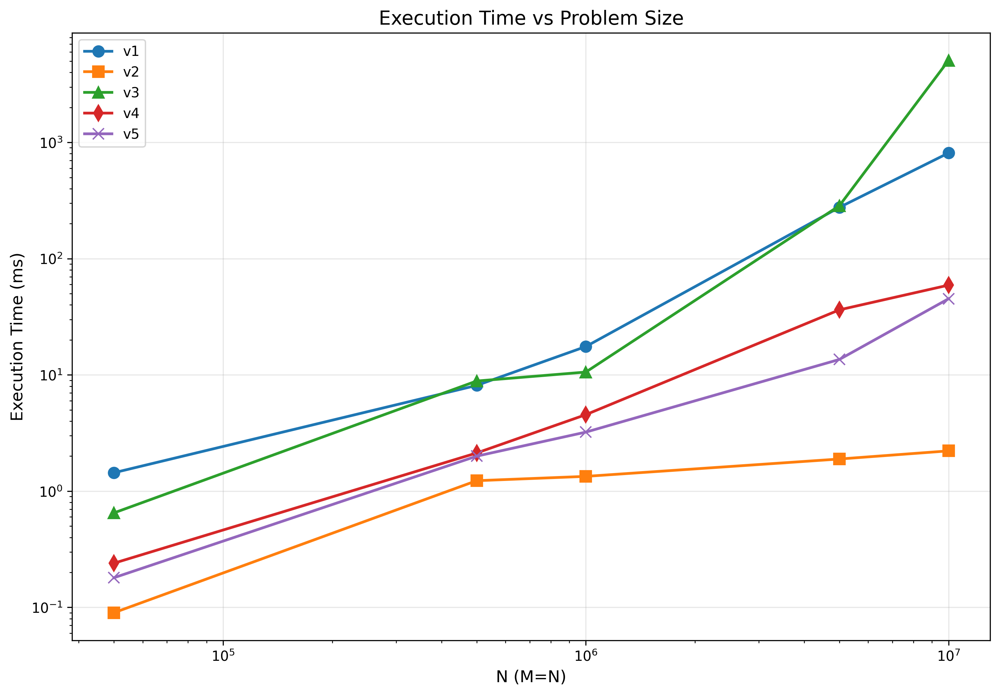
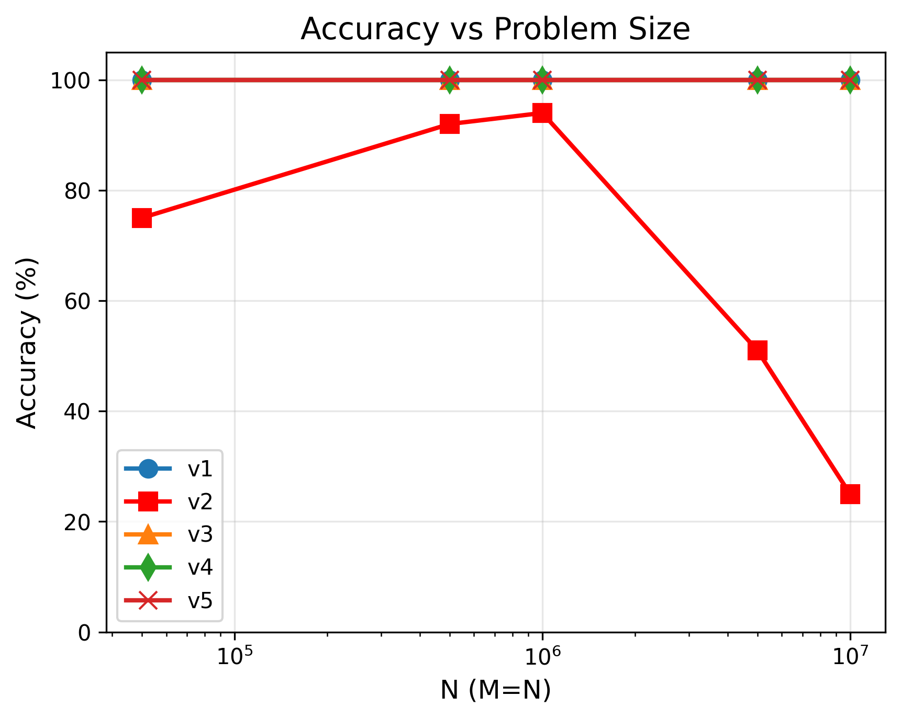

# CUDA Accelerated Ride-Matching Dispatcher

## Overview
This project implements a high‑performance, GPU‑accelerated simulation of a ride‑sharing dispatch system.  
Given **10 million riders** and **10 million drivers** uniformly distributed in a 1000×1000 unit world, the goal is to assign each rider to the **nearest available driver** while guaranteeing **no double‑booking**.

The solution evolves through five versions, each introducing key optimisations to reduce runtime and improve matching quality, culminating in a near‑linear time algorithm that runs in seconds on an NVIDIA RTX 3050.

---

## Key Techniques
- **Lock‑free driver booking** – A per‑driver bitmask and `atomicOr` ensure mutual exclusion without locks.
- **Spatial grid partitioning** – The world is divided into 100×100 cells (10×10 units each). Drivers are assigned to their cell, limiting searches to nearby cells.
- **Bounded radius expansion** – Riders search only within a small, fixed radius (`MAX_RADIUS = 5`), scanning only the perimeter of each expanding square.
- **Fallback global search** – The few riders not matched by the spatial search fall back to a full linear scan, guaranteeing 100% matching.
- **Coalesced memory access** – Driver coordinates are stored directly inside grid cells, eliminating random indirection and improving throughput.

---

## Version Evolution
Please Refer the individual folders for detailed explanations of each version’s approach.

---

## Performance & Accuracy Results

### Execution Time (seconds)

*Figure 1: Execution time (seconds) vs. problem size for all versions*

### Driver Matching Accuracy (%)

*Figure 2: Matching accuracy (%) vs. problem size for all versions*

> **Note**: v2 accuracy is looking low because the riders are assigned drives from only it's own cell. So, if the number of riders are more than the number of drivers in a cell the extra riders fails to secure a Ride. For 10M, v2 drops to ~51%.

---

## Conclusion
Starting from a brute‑force O(N²) baseline, we progressively introduced spatial partitioning, bounded radius expansion, perimeter‑only scanning, fallback global search, and coalesced data layout. The final version (v5) achieves **100% matching accuracy** on 10 million agents in **just 15 seconds** – a **15× speedup** over the naive implementation.